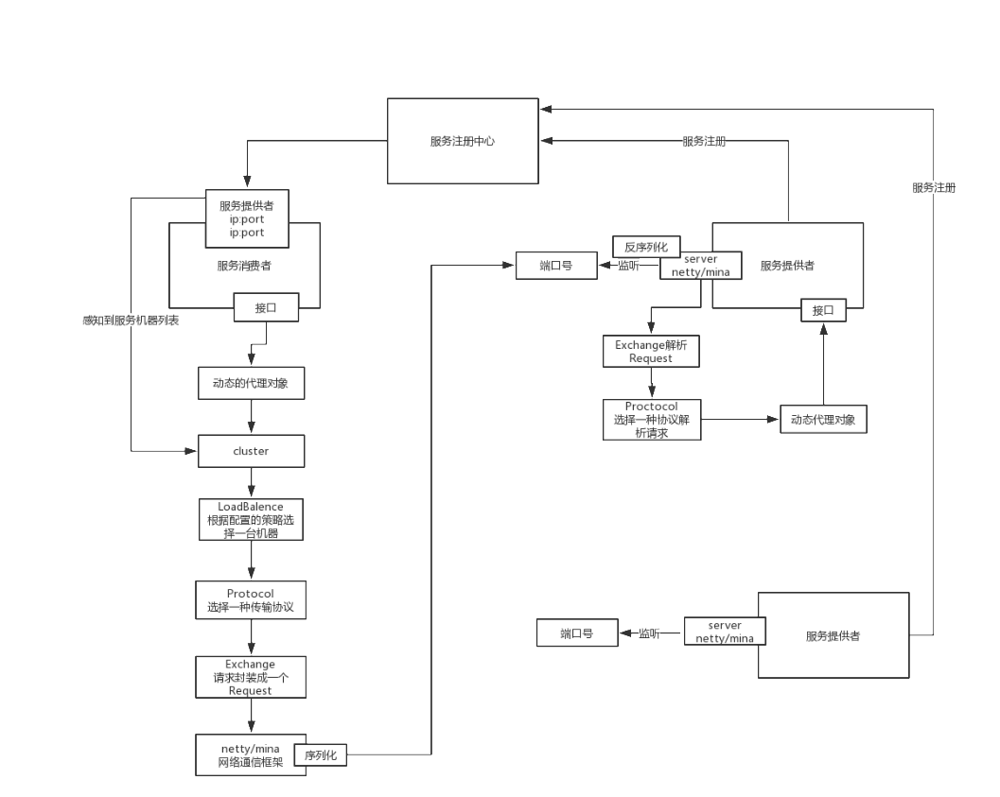

# sunny

#### 介绍
sunny 是一款基于Zookeeper为注册中心的，netty为通讯协议支持多种序列化的一款rpc 入门学习的项目
#### 软件架构
Zookeeper 为注册中心
netty 长连接 通讯

自定义Spring标签

###### 序列化：

* AvroSerializer

* HessianSerializer

* JavaDefaultSerializer

* JSON2Serializer

*　JSONSerializer

*　MarshallingSerializer

* ThriftSerializer

* XmlSerializer

###### 集群高可用负载均衡：

 * HashClusterStrategy

 * PollingClusterStrategy

 * RandomClusterStrategy

 * WeightPollingClusterStrategy

 * WeightRandomClusterStrategy

-----
#### 总体架构图

